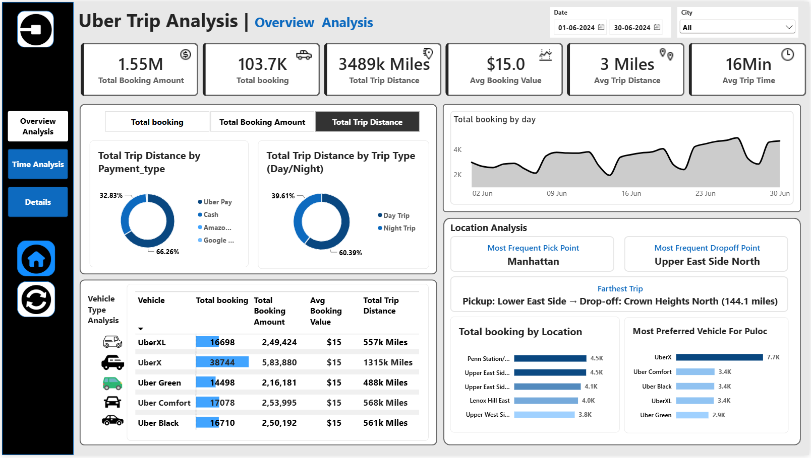
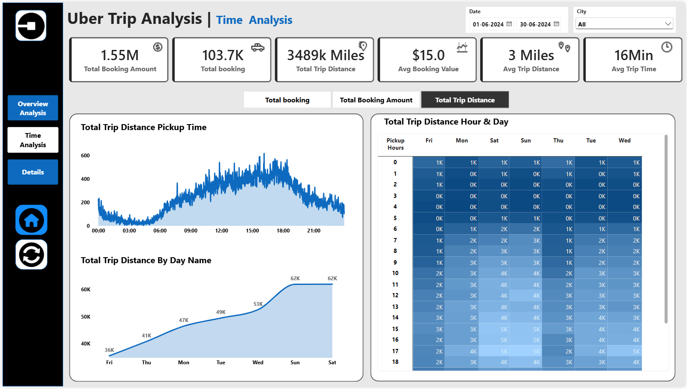
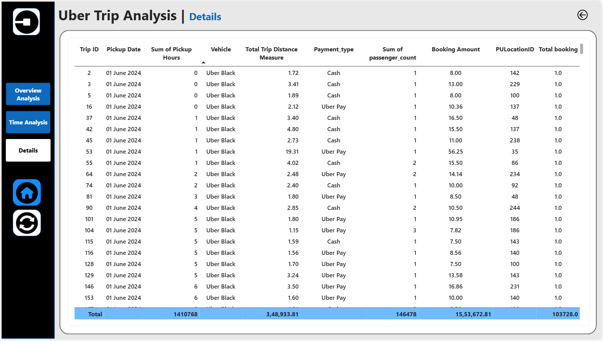

# Uber Trip Analysis Power BI Dashboard

An interactive Power BI dashboard analyzing Uber trips in June 2024.

## Dashboard Pages
- **Overview Analysis:** KPIs, payment type, day/night trips, vehicle analysis, daily trend
- **Time Analysis:** trip distance by pickup time, day of week and hour (heat map)
- **Details:** trip-level table

## Key Metrics
- 103.7K total bookings, $1.55M total booking amount
- $15 average booking value, 3 miles average trip distance

## Data Model
Star schema: Trip details (fact table), Dim_Location and a calendar table.

## Files
- `Uber Trip Analysis - Power BI Dashboard.pbix`: the dashboard
- `Uber Trip Details.xlsx`: trip data (fact table)
- `Dim_Location.xlsx`: location dimension table

## Tools
Power BI, Power Query, DAX, Excel

## Screenshots
### Overview

### Time Analysis

### Details

## How to open
Download the `.pbix` file and open it in Power BI Desktop (free).
